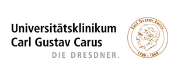

# Department of Urology at the University Hospital Carl Gustav Carus Dresden

Welcome to the official Github account of **Department of Urology** at the **University Hospital Carl Gustav Carus Dresden**.

We share open source content in many different areas to promot the application of digital tools in modern urology:

- :robot: AI and Deep Learning in Urology
- :abacus: Data science and statistics
- :classical_building: Digital education for medical students and trainees

> [!Note]
> We are always looking for new collaborations. Please reach out to us via X or LinkedIn.